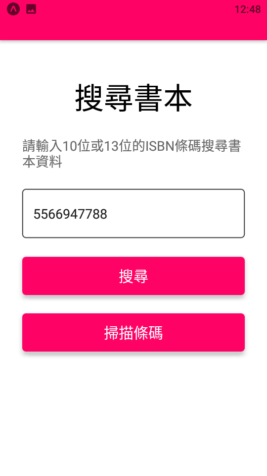

- 發布日期: 2022年1月21日
### 前言:
這是專案是我從我的 bitbucket 陳年倉庫中挖出來的，沒有文件只剩下原始碼  
當初大概是在網路上看到程式碼的，想把範例拼成我想要的POS系統APP

<!-- truncate -->

圖1:  


圖2:  


範例 source code:  
```shell
git clone https://smilehsu@bitbucket.org/smilehsu/barcode_booksearch0120.git
```

