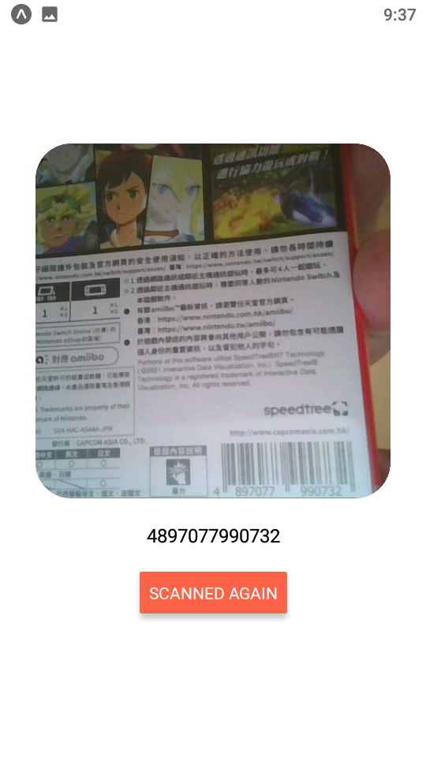

- 發布日期: 2022年1月19日
### 前言:
這是一個在Expo專案內使用Barcode 模組的範例 我學React Native的目標就是做一個進銷存的APP 條碼掃描的功能是必須的，今天這個範例讓我離目標更進一步 :)

<!-- truncate -->

目前開發環境:

```shell
node.js: v14.17.6
npm: 6.14.15
react: 17.0.1
react-native: 0.64.3
expo: 44.0.4 ※手機需要安裝 EXPO Go (Android / iOS)
```


心得總結:
``` shell
使用 expo-barcode-scanner 套件
程式碼的內容相當精簡與簡單...出乎意料之外 XDD
```

範例 source code:
```shell
git clone https://smilehsu@bitbucket.org/smilehsu/yt_example_barcode0119.git
```

---
### Reference:

- QR & Barcode Scanner App Tutorial in React Native (YT連結已失效)
- [Expo-BarCodeScanner](https://docs.expo.dev/versions/latest/sdk/bar-code-scanner/)
