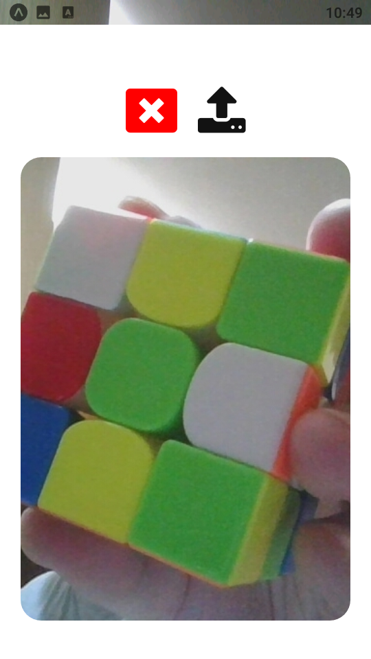
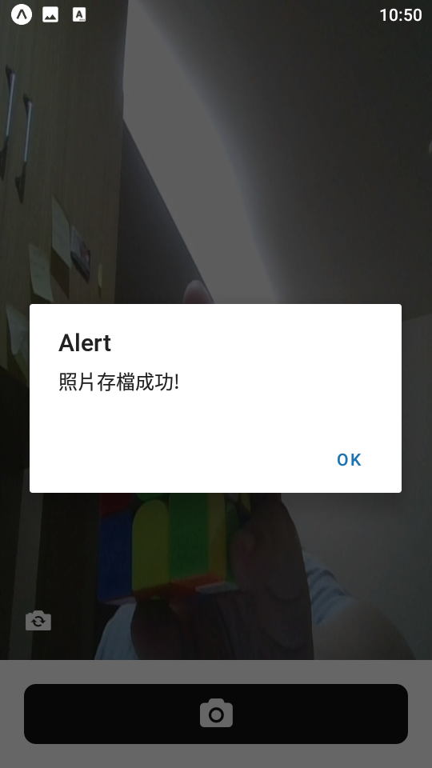
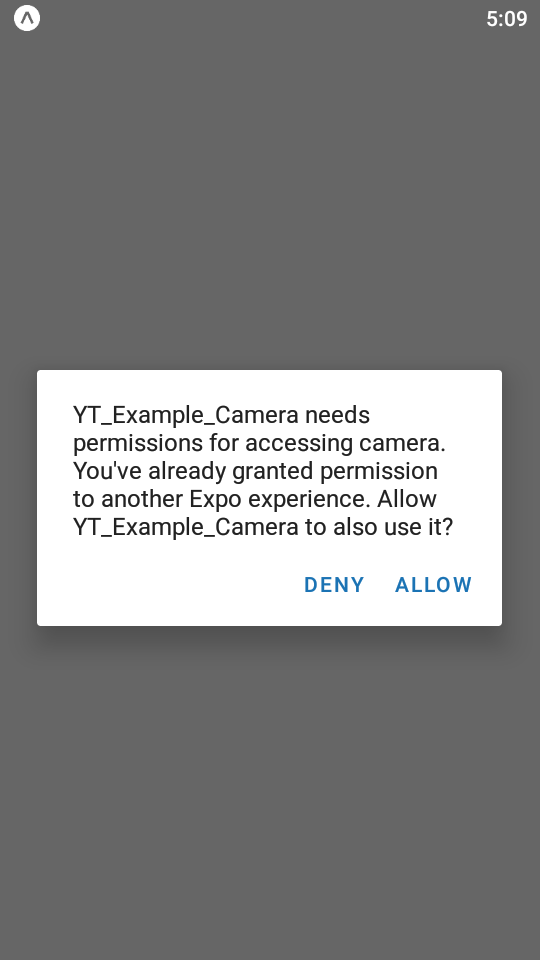
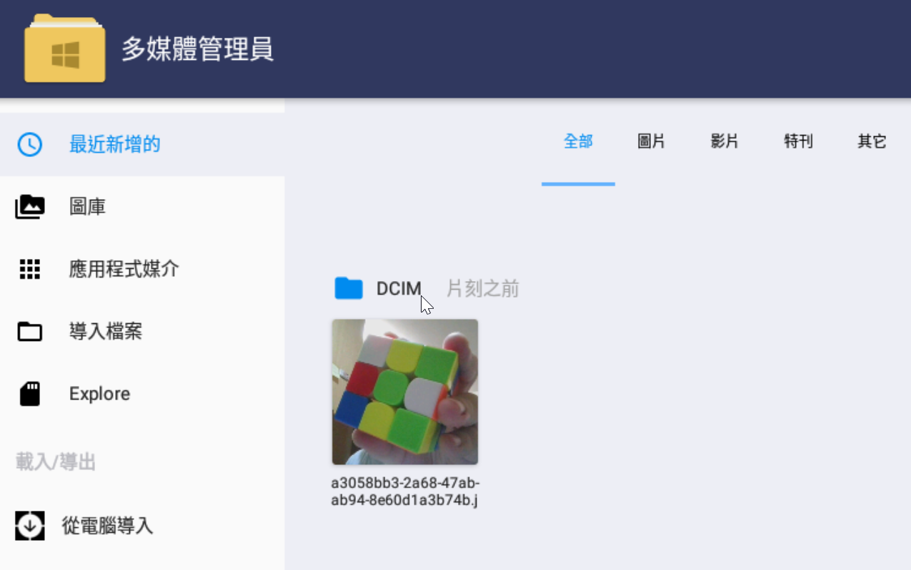

- 發布日期: 2022年1月18日
### 前言:
這是一個使用相機模組的範例，在YT上面要找到符合我的需求的 沒想到最後找到一個用西班牙語?的教學影片，我一句都聽不懂的情況下 照著影片keyin 還是順利完成

<!-- truncate -->

我的教材選擇標準:
1.要用EXPO 2.要使用Function的寫法(要用Hook)，不要Class 3.影片長度要10分以上30分以內 4.程式內容要簡單，也不要有複雜的UI介面 單一檔案最好(App.js)
目前開發環境:
node.js: v14.17.6
npm: 6.14.15
react: 17.0.1
react-native: 0.64.3
expo: 44.0.4 ※手機需要安裝 EXPO Go (Android / iOS)
程式碼:
圖1:


圖2:



### 心得總結:
1. 使用 useRef (第一次用不是很熟)
2. 用到 Permissions (第一次用不是很熟)
3. 使用 expo-camera套件
4. 使用 image套件
5. 使用 Modal套件 (第一次用不是很熟)

註解:
```
影片的內容(part1)很順利地做完，做第二片(part2)實作存檔功能時就卡關了

expo-permissions is now deprecated ...又碰到 套件被放生的情況
還有在stackoverflow 有查到替代的方案，順利解決。
```

圖3:


圖4: 照片都會存在DCIM的資料夾內，在模擬器裡用檔案管理員可以查看



範例 source code:

```shell
git clone https://smilehsu@bitbucket.org/smilehsu/rn_example_camera.git
```

---
### Reference:
- Manipulando a camera – React Native + Expo pt 01 (YT連結已失效)
- Manipulando a camera – React Native + Expo pt. 02 (YT連結已失效)
- [Expo Camera (SDK 44)](https://docs.expo.dev/versions/latest/sdk/camera/)
- [expo-media-library](https://docs.expo.dev/versions/latest/sdk/media-library/%0A)
- [React Native expo-permission deprecated what to use now?](https://stackoverflow.com/questions/68668152/react-native-expo-permission-deprecated-what-to-use-now)
- [@expo/vector-icons@12.0.5](https://icons.expo.fyi/)