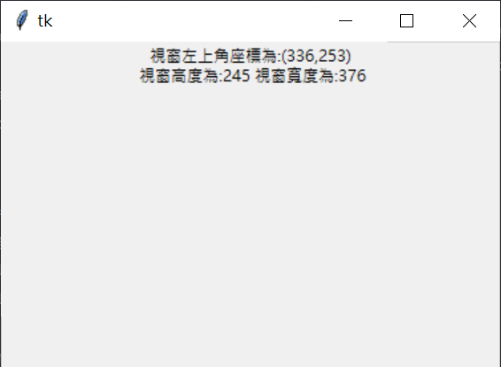
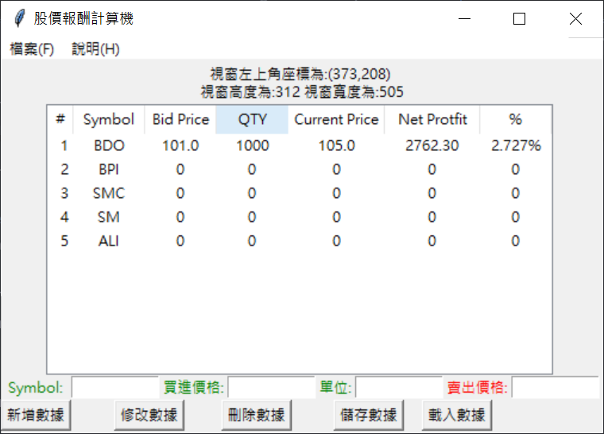
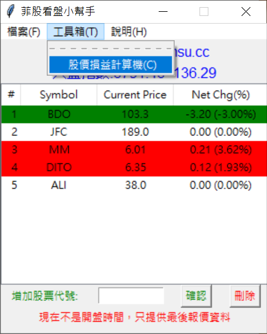

- 發布日期: 2020年12月1日
### 前言:

上一篇完成我的第一支Python GUI介面的程式(ToDoList )之後 接下就來做一隻真正能用的GUI 程式，上一隻就當是練習用的

<!-- truncate -->

這隻程式用途是計算股價損益的計算 輸入某股票在XX元買入，在XX元賣出的損益計算 這個功能用Execel 大概幾分鐘就完成了… 要在Pyhton + Tkinter 底下實作，花了不少時間

以下是程式的外觀:  
[demo](StcokCalculator.png)

以下直接上程式碼:
``` python
import tkinter as tk
from tkinter import ttk
from tkinter import messagebox
import csv

root = tk.Tk()
root.title("股價報酬計算機")
root.geometry("520x340")

def savefile():
    with open("mystock_price.csv", "w", newline='') as myfile:
        csvwriter = csv.writer(myfile, delimiter=',')

        for row_id in tree.get_children():
            row = tree.item(row_id)['values']
            #print('save row:', row)
            csvwriter.writerow(row)

def loadfile():
    clean_treeview()
    with open("mystock_price.csv") as myfile:
        csvread = csv.reader(myfile, delimiter=',')

        for row in csvread:
            #print('load row:', row)
            tree.insert("", 'end', values=row)

n = 1

def summy():
    global n
    1. 股價損益計算公式
    1. (賣價x單位)-(((賣價x單位)*0.0025)+((賣價x單位)*0.0025)*0.12+((賣價x單位)*0.006)+((賣價x單位)*0.00005)+((賣價x單位)*0.0001)))-((買價x單位)+((買價x單位)*0.0025)+((買價x單位)*0.0025)*0.12+((買價x單位)*0.00005)+((買價x單位)*0.0001)
    1. (currentprice*qty)-(((currentprice*qty)*0.0025)+((currentprice*qty)*0.0025)*0.12+((currentprice*qty)*0.006)+((currentprice*qty)*0.00005)+((currentprice*qty)*0.0001))-((bidprice*qty)+((bidprice*qty)*0.0025)+((bidprice*qty)*0.0025)*0.12+((bidprice*qty)*0.00005)+((bidprice*qty)*0.0001))

    symbol = txt_input_symbol.get().upper()
    bidprice = txt_input_bidprice.get()
    qty = txt_input_qty.get()
    currentprice = txt_input_currentprice.get()

    if symbol == '' or bidprice == '' or qty == '' or currentprice == '':
        messagebox.showwarning("錯誤訊息", "請輸入資料!!!")

    else:
        try:
            bidprice = float(bidprice)
            qty = float(qty)
            currentprice = float(currentprice)

            buy = float((bidprice*qty)+((bidprice*qty)*0.0025)+((bidprice*qty)
                                                                * 0.0025)*0.12+((bidprice*qty)*0.00005)+((bidprice*qty)*0.0001))
            1. 賣出淨額(稅後)
            sell = float((currentprice*qty)-((currentprice*qty)*0.0025)-((currentprice*qty)*0.0025) *
                         0.12-((currentprice*qty)*0.006)-((currentprice*qty)*0.00005)-((currentprice*qty)*0.0001))
            1. 利潤
            net_protfit = format((sell-buy), '.2f')
            1. 利潤 % 數
            net_protfit_percent = format(((sell-buy)/buy), '.3%')

            1. 欄位:  編號 symbol 買進價格 單位 現價 利潤 利潤%數
            1. 只會用到 symbol 現價 其他5欄位的資料來自 輸入框 & 計算
            if len(tree.get_children()) >= 10:
                messagebox.showwarning("提示訊息", "資料只能10筆以下")
            else:
                i = [int(n), str(symbol), str(bidprice), str(qty), str(
                    currentprice), str(net_protfit), str(net_protfit_percent)]
                tree.insert('', 'end', values=i)
                n += 1
        except:
            messagebox.showwarning("錯誤訊息", "請輸入正確格式!!!")

def treeSel(event):
    item = tree.selection()
    itemvalues = tree.item(item, 'values')

    '''
    測試用 看有幾筆資料
    print(len(tree.get_children()))
    測試用 看item值
     print(len(itemvalues),itemvalues)
    n=0
    for i in itemvalues:
        print('item{}={}'.format(n,i))
        n+=1
    '''
    1. 清除輸入框
    clearEntry()
    1. 更新輸入框的值
    txt_input_symbol.insert(0, itemvalues[1])
    txt_input_bidprice.insert(0, itemvalues[2])
    txt_input_qty.insert(0, itemvalues[3])
    txt_input_currentprice.insert(0, itemvalues[4])

def modify_column():
    pass

def del_column():
    try:
        selected_item = tree.selection()[0]  # get selected item
        tree.delete(selected_item)
    except:
        messagebox.showwarning("錯誤訊息", "請點選要刪除的資料!!!")

def clearEntry():
    txt_input_symbol.delete(0, 'end')
    txt_input_bidprice.delete(0, 'end')
    txt_input_qty.delete(0, 'end')
    txt_input_currentprice.delete(0, 'end')

    '''
    #end改成引號+小寫
    #https://bit.ly/36g3GXN
    #python - How to clear the Entry widget after a button is pressed in Tkinter? - Stack Overflow
    #原本的寫法 不會過
    sidEntry.delete(0, END)

    '''

def clean_treeview():
    tree.delete(*tree.get_children())

1. ===================================================================================
1. 功能表
filemenu = tk.Menu(root)
root.config(menu=filemenu)

menu1 = tk.Menu(filemenu)
menu2 = tk.Menu(filemenu)

menu1.add_command(label='讀取股價損益名單(O)', command=loadfile)
menu1.add_command(label='儲存股價損益名單(S)', command=savefile)

filemenu.add_cascade(label='檔案(F)', menu=menu1)
filemenu.add_cascade(label='說明(H)')
1. ===================================================================================
lbl_label1 = tk.Label(root)
lbl_label1.grid(row=0, column=0, columnspan=8)
1. ===================================================================================
1. 欄位:  編號 symbol 買進價格 單位 現價 利潤 利潤%數
columns = ('0', '1', '2', '3', '4', '5', '6')
tree = ttk.Treeview(root, show='headings', columns=columns)
tree.column('0', width=22, anchor='e')
tree.column('1', width=60, anchor='center')
tree.column('2', width=60, anchor='center')
tree.column('3', width=60, anchor='center')
tree.column('4', width=80, anchor='center')
tree.column('5', width=80, anchor='center')
tree.column('6', width=60, anchor='center')

1. 欄位顏色設定 source: https://bit.ly/2TurTTc
tree.tag_configure('+', background='red')
tree.tag_configure('-', background='green')

tree.heading('0', text='#')
tree.heading('1', text='Symbol')
tree.heading('2', text='Bid Price')
tree.heading('3', text='QTY')
tree.heading('4', text='Current Price')
tree.heading('5', text='Net Protfit')
tree.heading('6', text='%')
tree.grid(row=1, column=0, columnspan=8)
1. ===================================================================================

lbl_symbol = tk.Label(root, text="Symbol:", fg="green")
lbl_symbol.grid(row=2, column=0)
txt_input_symbol = tk.Entry(root, width=10)
txt_input_symbol.grid(row=2, column=1)

lbl_bidprice = tk.Label(root, text="買進價格:", fg="green")
lbl_bidprice.grid(row=2, column=2)
txt_input_bidprice = tk.Entry(root, width=10)
txt_input_bidprice.grid(row=2, column=3)

lbl_qty = tk.Label(root, text="單位:", fg="green")
lbl_qty.grid(row=2, column=4)
txt_input_qty = tk.Entry(root, width=10)
txt_input_qty.grid(row=2, column=5)

lbl_currentprice = tk.Label(root, text="賣出價格:", fg="red")
lbl_currentprice.grid(row=2, column=6)
txt_input_currentprice = tk.Entry(root, width=10)
txt_input_currentprice.grid(row=2, column=7)

1. ===================================================================================

btn_confirm = tk.Button(root, text='新增數據', command=summy)
btn_confirm.grid(row=3, column=0, columnspan=1)

btn_confirm = tk.Button(root, text='修改數據', command=modify_column)
btn_confirm.grid(row=3, column=1, columnspan=2)

btn_confirm = tk.Button(root, text='刪除數據', command=del_column)
btn_confirm.grid(row=3, column=2, columnspan=3)

btn_save = tk.Button(root, text='儲存數據', command=savefile)
btn_save.grid(row=3, column=3, columnspan=4)

btn_save = tk.Button(root, text='載入數據', command=loadfile)
btn_save.grid(row=3, column=4, columnspan=5)

1. ===================================================================================
1. 測試用資料

tree.insert('', 'end', values=['1', 'BDO', '101.0',
                               '1000', '105.0', '2762.30', '2.727%'])
tree.insert('', 'end', values=['2', 'BPI', '0', '0', '0', '0', '0'])
tree.insert('', 'end', values=['3', 'SMC', '0', '0', '0', '0', '0'])
tree.insert('', 'end', values=['4', 'SM', '0', '0', '0', '0', '0'])
tree.insert('', 'end', values=['5', 'ALI', '0', '0', '0', '0', '0'])

1. ===================================================================================

tree.bind('<<TreeviewSelect>>', treeSel)
1. ===================================================================================

root.mainloop()
```

心得&補充:
這篇主要是使用 treeview 這個元件 老實說這個元件好用歸好用，但有關於dom的操作真的不是很直覺 程式寫完，我還不知道怎麼直接拿到index 要怎麼對row 跟 column 做排序、處理或加總 還是pandas 好用許多 …可惜tkinter 目前好像沒有這功能

另外程式完成後，視窗的大小比例怪怪的 這邊同場加映，在拖曳是窗位置或調整大小時，可以看到視窗目前的座標跟大小



程式碼:  
``` python
import tkinter as tk

def go():

    txt = '視窗左上角座標為:({},{})\n 視窗高度為:{} 視窗寬度為:{}'.format(
        root.winfo_x(), root.winfo_y(),  root.winfo_height(), root.winfo_width())
    label1.configure(text=txt)
    root.after(1, go)

root = tk.Tk()
root.geometry("400x200+100+50")
label1 = tk.Label(root)
label1.pack()
go()
root.mainloop()
```
把程式套用在本次的實例中:  



這樣對程式的外觀那邊要調整就一目了然 :)
另外這隻程式是我的股價小幫手的一個附屬工具程式

