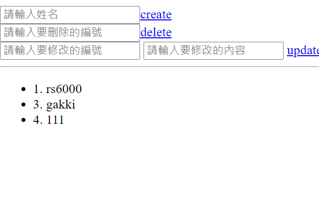
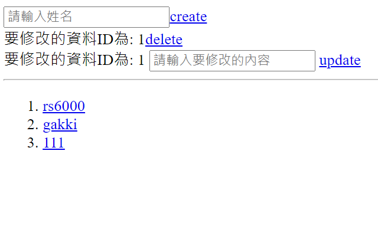
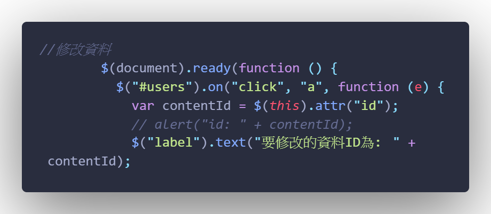

- 發布日期: 2020年5月24日
### 前言:

本篇是紀錄JavaScript RESTful API的簡單學習筆記  
學習的內容來自 [ Alex 宅幹嘛 ] 👨‍💻 JSON 與 RESTFUL API 串接一次搞定  

<!-- truncate -->

上一篇 [筆記] 使用VUE建立RESTful API 也是看Alex大大的教學影片 實作VUE的RESTful API  
才發現自己對JS完全不熟，還好Alex頻道上有 有JS版的RESTful API教學  
所以就花了點時間練習…感謝Alex大大  

這次的內容會使用到 json-server套件
在之前的文章已經有提過怎麼使用了 請查閱[筆記] 使用VUE建立RESTful API  

所需要的 data.json格式 如下:  

```json 
{"users":
    [
        {"name":"胖虎",
        "id":1}
    ]
}
```

### 版本一
這個版本為 [ Alex 宅幹嘛 ] 👨‍💻 JSON 與 RESTFUL API 串接一次搞定 最後所完成的範例程式  


```js
<!DOCTYPE html>
<html lang="en">
  <head>
    <meta charset="UTF-8" />
    <meta http-equiv="X-UA-Compatible" content="IE=edge" />
    <meta name="viewport" content="width=device-width, initial-scale=1.0" />

    <title>Document</title>
  </head>
  <body>
    <!-- 新增資料 -->
    <div id="create">
      <input type="text" placeholder="請輸入姓名" /><a href="javascript:;"
        >create</a
      >
    </div>
    <!-- 刪除資料 -->
    <div id="delete">
      <input type="text" placeholder="請輸入要刪除的編號" /><a
        href="javascript:;"
        >delete</a
      >
    </div>
    <!-- 修改資料 -->
    <div id="update">
      <input type="text" placeholder="請輸入要修改的編號" name="id" />
      <input type="text" placeholder="請輸入要修改的內容" name="name" />
      <a href="javascript:;">update</a>
    </div>

    <!--  -->
    <hr />
    <ul id="users"></ul>
    <script
      src="https://cdnjs.cloudflare.com/ajax/libs/jquery/3.6.0/jquery.min.js"
      integrity="sha512-894YE6QWD5I59HgZOGReFYm4dnWc1Qt5NtvYSaNcOP+u1T9qYdvdihz0PPSiiqn/+/3e7Jo4EaG7TubfWGUrMQ=="
      crossorigin="anonymous"
    ></script>
    <script>
      $(function () {
        $.ajax({
          url: "http://localhost:3000/users",
          method: "get",
          dataType: "json",
          data: {},
        })
          .done(function (res) {
            console.log(res);
            $("#users").empty();
            //ES6寫法
            res.forEach((user) => {
              $("#users").append("<li>" + user.id + ". " + user.name + "</li>");
            });

            //舊的寫法
            // res.forEach(function (user) {
            //   $("#users").append("<li>" + user.name + "</li>");
            // });
          })
          .fail(function (err) {
            console.log(err);
          });
        //新增資料
        $("#create > a").on("click", function () {
          let name = $("#create >input").val();
          if (!name) {
            alert("請輸入資料!!!");
            return false;
          }
          $.ajax({
            url: "http://localhost:3000/users",
            method: "post",
            dataType: "json",
            data: {
              name: name,
            },
          });
        });
        //刪除資料
        $("#delete > a").on("click", function () {
          let id = $("#delete >input").val();
          if (!id) {
            alert("請輸入資料!!!");
            return false;
          }
          $.ajax({
            url: "http://localhost:3000/users/" + id,
            method: "delete",
            dataType: "json",
          });
        });
        //修改資料
        $("#update > a").on("click", function () {
          let id = $("#update > input[name=id]").val();
          let name = $("#update > input[name=name]").val();
          if (!id || !name) {
            alert("資料不得為空值");
            return false;
          }
          console.log("資料輸入成功!");
          $.ajax({
            url: "http://localhost:3000/users/" + id,
            method: "put",
            dataType: "json",
            data: {
              name: name,
            },
          });
        });
      });
    </script>
  </body>
</html>
```


### 版本二


版本二程式碼如下:

```js
<!DOCTYPE html>
<html lang="en">
  <head>
    <meta charset="UTF-8" />
    <meta http-equiv="X-UA-Compatible" content="IE=edge" />
    <meta name="viewport" content="width=device-width, initial-scale=1.0" />

    <title>Document</title>
  </head>
  <body>
    <!-- 新增資料 -->
    <div id="create">
      <input type="text" placeholder="請輸入姓名" /><a href="javascript:;"
        >create</a
      >
    </div>
    <!-- 刪除資料 -->
    <div id="delete">
      <label>請選取要刪除的編號</label><a href="javascript:;">delete</a>
    </div>
    <!-- 修改資料 -->
    <div id="update">
      <label>請選取要修改的編號</label>
      <input type="text" placeholder="請輸入要修改的內容" name="name" />
      <a href="javascript:;">update</a>
    </div>

    <!--  -->
    <hr />
    <ol id="users"></ol>
    <script
      src="https://cdnjs.cloudflare.com/ajax/libs/jquery/3.6.0/jquery.min.js"
      integrity="sha512-894YE6QWD5I59HgZOGReFYm4dnWc1Qt5NtvYSaNcOP+u1T9qYdvdihz0PPSiiqn/+/3e7Jo4EaG7TubfWGUrMQ=="
      crossorigin="anonymous"
    ></script>
    <script>
      $(function () {
        $.ajax({
          url: "http://localhost:3000/users",
          method: "get",
          dataType: "json",
          data: {},
        })
          .done(function (res) {
            console.log(res);
            $("#users").empty();
            //ES6寫法
            res.forEach((user) => {
              $("#users").append(
                '<li><a href="javascript:;" id=' +
                  user.id +
                  ">" +
                  user.name +
                  "</a></li>"
              );
            });

            //舊的寫法
            // res.forEach(function (user) {
            //   $("#users").append("<li>" + user.name + "</li>");
            // });
          })
          .fail(function (err) {
            console.log(err);
          });
        //新增資料
        $("#create > a").on("click", function () {
          let name = $("#create >input").val();
          if (!name) {
            alert("請輸入資料!!!");
            return false;
          }
          $.ajax({
            url: "http://localhost:3000/users",
            method: "post",
            dataType: "json",
            data: {
              name: name,
            },
          });
        });
        //刪除資料
        $(document).ready(function () {
          $("#users").on("click", "a", function (e) {
            var contentId = $(this).attr("id");
            // alert("id: " + contentId);
            $("label").text("要刪除的資料ID為: " + contentId);
            //
            $("#delete > a").on("click", function () {
              $.ajax({
                url: "http://localhost:3000/users/" + contentId,
                method: "delete",
                dataType: "json",
              });
            });
          });
        });
        //修改資料
        $(document).ready(function () {
          $("#users").on("click", "a", function (e) {
            var contentId = $(this).attr("id");
            // alert("id: " + contentId);
            $("label").text("要修改的資料ID為: " + contentId);
            //
            $("#update > a").on("click", function () {
              let name = $("#update > input[name=name]").val();
              if (!contentId || !name) {
                alert("資料不得為空值");
                return false;
              }
              console.log("資料輸入成功!");
              $.ajax({
                url: "http://localhost:3000/users/" + contentId,
                method: "put",
                dataType: "json",
                data: {
                  name: name,
                },
              });
            });
          });
        });
        //

        //程式結尾
      });
    </script>
  </body>
</html>
```

在版本2與版本1不同的地方是:刪除跟修改的功能不需要自己填物件的id值 並把原先ul 改成 ol

以下是實作版本2的過程中所碰到的問題:

#### 問題1: 將 id值塞入a tag裡面


答:
這個不管寫什麼程式都會碰到…(寫python也碰過) 字串裡面要加入變數，就要跟單引號雙引號反斜線…勾勾纏 我只能一個一個慢慢試…

#### 問題2:點擊a tag時，取得相對應的id值



答:
這部分一開始google的解答，都不是我要的… 例如:頁面只有一個連結，把連結寫死a[0]、a[1]之類的 最後找到解答，不過版本太舊 Jqurey 1.9就不支援 詳細內容參考Reference 2 and 3
以上就是這次筆記的內容，想要學VUE還是乖乖的從JS學起…

---

### Reference:
- [ Alex 宅幹嘛 ] 👨‍💻 JSON 與 RESTFUL API 串接一次搞定 (連結已失效)
- [Use jQuery click to handle anchor onClick()](https://bit.ly/3fDSOX7) 
- [jQuery 1.9 .live() is not a function](https://bit.ly/3fEpJuT)