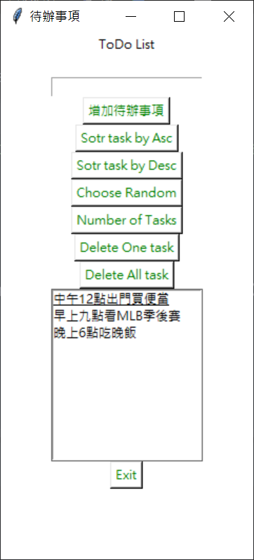
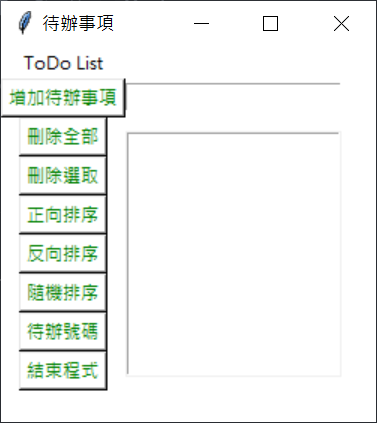
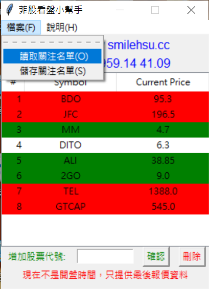

- 發布日期: 2020年12月1日
### 前言:

本篇是紀錄Python 圖形化介面的學習過程 所使用的套件是內建的 Tkinter  
內容來自 YT上面的教學影片(連結) 看完就可以完成一個  
待辦事項(ToDoList) 的小軟體雖然沒什麼實用性…  

<!-- truncate -->

以下我就直接上程式碼了:

``` python
import tkinter
import random
root= tkinter.Tk()
#lbl_title=tkinter.Label(root.title("這是標題列"))
#chang root windows background color
root.configure(bg="white")
#title
root.title("待辦事項")
#size
root.geometry("240x500")
#======================
#create an empty list
tasks=[]
#for testing purposes  sue a default list
tasks=["早上九點看MLB季後賽","中午12點出門買便當","晚上6點吃晚飯"]

#======================
def update_listbox():
    #clear the current list
    clear_listbox()
    #populate the listbox
    for task in tasks:
        lb_tasks.insert("end",task)

def clear_listbox():
    lb_tasks.delete(0,"end")

def add_task():
    task= txt_input.get()
    #make sure the task is not empty
    if task !="":
        #addpend to the list
        tasks.append(task)
        update_listbox()
    else:
        lbl_display["text"]="不能輸入空白"
    #清除輸入列的文字    
    txt_input.delete(0,"end")

def del_all_tasks():
    global tasks
    #clear the tasks list
    tasks=[]
    #update
    update_listbox()

def delete_one_task():
    #get the text of the currently selected item
    task=lb_tasks.get("active")
    #confirm it is in the list
    if task in tasks:
        tasks.remove(task)
    #update the list
    update_listbox()

def sort_asc():
    tasks.sort()
    update_listbox()

def sort_desc():
    tasks.sort()
    tasks.reverse()
    update_listbox()

def choose_random():
    task=random.choice(tasks)
    #Update the display label
    lbl_display["text"]=task   

def show_number_of_tasks():
    number_of_tasks=len(tasks)
    #create and format the message
    msg="Number of tasks:{}".format(number_of_tasks)
    #display the message
    lbl_display["text"]=msg

#結束程式
def exit():
    pass

lbl_title=tkinter.Label(root,text="ToDo List", bg="white")
lbl_title.pack()
#======================
lbl_display=tkinter.Label(root,text="", bg="white")
lbl_display.pack()
#======================
txt_input=tkinter.Entry(root,width=20)
txt_input.pack()
#======================
btn_add_task=tkinter.Button(root,text="增加待辦事項", fg="green",bg="white",command=add_task)
btn_add_task.pack()
#======================
btn_sort_asc=tkinter.Button(root,text="Sotr task by Asc", fg="green",bg="white",command=sort_asc)
btn_sort_asc.pack()
#======================
btn_sort_desc=tkinter.Button(root,text="Sotr task by Desc", fg="green",bg="white",command=sort_desc)
btn_sort_desc.pack()
#======================
btn_choose_random=tkinter.Button(root,text="Choose Random", fg="green",bg="white",command=choose_random)
btn_choose_random.pack()
#======================
btn_number_of_tasks=tkinter.Button(root,text="Number of Tasks", fg="green",bg="white",command=show_number_of_tasks)
btn_number_of_tasks.pack()
#======================
btn_delete_one=tkinter.Button(root,text="Delete One task", fg="green",bg="white",command=delete_one_task)
btn_delete_one.pack()
#======================
btn_delete_all=tkinter.Button(root,text="Delete All task", fg="green",bg="white",command=del_all_tasks)
btn_delete_all.pack()
#======================
lb_tasks=tkinter.Listbox(root)
lb_tasks.pack()
#======================
btn_exit=tkinter.Button(root,text="Exit", fg="green",bg="white",command=exit)
btn_exit.pack()
#======================
root.mainloop()

```

上面的程式碼執行的結果如下圖:  


接下來另一隻程式的layout 是用grid (上面是pack)

``` python
import tkinter
import random
from tkinter import messagebox
root= tkinter.Tk()
#lbl_title=tkinter.Label(root.title("這是標題列"))
#chang root windows background color
root.configure(bg="white")
#title
root.title("待辦事項")
#size(寬x高)
root.geometry("250x250")
#======================
#create an empty list
tasks=[]
#for testing purposes  sue a default list
#tasks=["早上九點看MLB季後賽","中午12點出門買便當","晚上6點吃晚飯"]

#======================
def update_listbox():
    #clear the current list
    clear_listbox()
    #populate the listbox
    for task in tasks:
        lb_tasks.insert("end",task)

def clear_listbox():
    lb_tasks.delete(0,"end")

def add_task():
    task= txt_input.get()
    #make sure the task is not empty
    if task !="":
        #addpend to the list
        tasks.append(task)
        update_listbox()
        lbl_display["text"]=""
    else:
        #lbl_display["text"]="不能輸入空白"
        messagebox.showwarning("錯誤訊息","請輸入資料!!!")
    #清除輸入列的文字    
    txt_input.delete(0,"end")

def del_all_tasks():
    confirmed = messagebox.askyesno("資料刪除確認","確定刪除全部資料?")
    if confirmed == True:
        global tasks
        #clear the tasks list
        tasks=[]
        #update
        update_listbox()
    else:
        pass

def delete_one_task():
    #get the text of the currently selected item
    task=lb_tasks.get("active")
    #confirm it is in the list
    if task in tasks:
        tasks.remove(task)
    #update the list
    update_listbox()

def sort_asc():
    tasks.sort()
    update_listbox()

def sort_desc():
    tasks.sort()
    tasks.reverse()
    update_listbox()

def choose_random():
    task=random.choice(tasks)
    #Update the display label
    lbl_display["text"]=task

def show_number_of_tasks():
    number_of_tasks=len(tasks)
    #create and format the message
    msg="Number of tasks:{}".format(number_of_tasks)
    #display the message
    lbl_display["text"]=msg

#結束程式
def exit():
    pass

#左邊布局
#======================
lbl_title=tkinter.Label(root,text="ToDo List", bg="white")
lbl_title.grid(row=0,column=0)
#======================
btn_add_task=tkinter.Button(root,text="增加待辦事項", fg="green",bg="white",command=add_task)
btn_add_task.grid(row=1,column=0)
#======================
btn_delete_all=tkinter.Button(root,text="刪除全部", fg="green",bg="white",command=del_all_tasks)
btn_delete_all.grid(row=2,column=0)
#======================
btn_delete_one=tkinter.Button(root,text="刪除選取", fg="green",bg="white",command=delete_one_task)
btn_delete_one.grid(row=3,column=0)
#======================
btn_sort_asc=tkinter.Button(root,text="正向排序", fg="green",bg="white",command=sort_asc)
btn_sort_asc.grid(row=4,column=0)
#======================
btn_sort_desc=tkinter.Button(root,text="反向排序", fg="green",bg="white",command=sort_desc)
btn_sort_desc.grid(row=5,column=0)
#======================
btn_choose_random=tkinter.Button(root,text="隨機排序", fg="green",bg="white",command=choose_random)
btn_choose_random.grid(row=6,column=0)
#======================
btn_number_of_tasks=tkinter.Button(root,text="待辦號碼", fg="green",bg="white",command=show_number_of_tasks)
btn_number_of_tasks.grid(row=7,column=0)
#======================
btn_exit=tkinter.Button(root,text="結束程式", fg="green",bg="white",command=exit)
btn_exit.grid(row=8,column=0)
#======================

#右邊布局
#======================
lbl_display=tkinter.Label(root,text="", bg="white")
lbl_display.grid(row=0,column=1)
#======================
txt_input=tkinter.Entry(root,width=20)
txt_input.grid(row=1,column=1)
#======================
lb_tasks=tkinter.Listbox(root)
lb_tasks.grid(row=2,column=1,rowspan=7)
#======================
root.mainloop()
```

第二隻程式執行結果下圖:  


最後補上一個空的介面
``` python
import tkinter as tk
root = tk.Tk()

root.title("第一個GUI")
root.geometry("300x300")

root.mainloop()
```

以上就是第一個學習Python Tkinter的材料 當初看這影片  
因為YT上沒有附上完成的原始碼 所以也是乖乖的把全部的影片慢慢看完…  
後來才找到作者另外發布的程式碼…浪費好多時間 = =|||

雖然這個範例沒啥小路用，不過藉由這個範例開始我的tkinter的學習之旅  
最近就做出下面的小工具



這個程式…日後再來分享(紀錄)

---
### Reference:
- Python Tkinter GUI Tutorial: To Do List 1 (連結已失效)
- Video Tutorial: Python To-Do-List (GUI Version) (連結已失效)
- Python Tkinter To-do List (連結已失效)
- [python tkinter sqlite3で家計簿を作る](https://bit.ly/3pFPpeF)