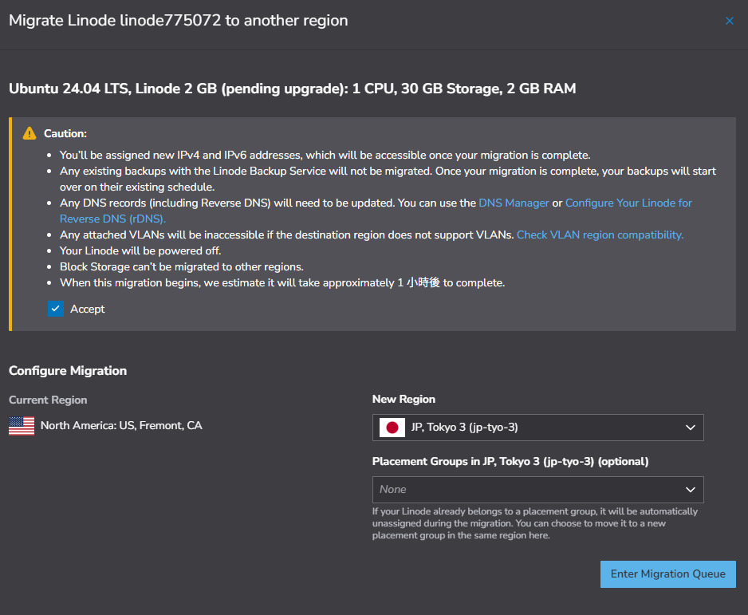

目前我的主機提供商是Linode(現在被收購改名叫Akamai)
這台主機用到現在大概有8年了，會持續用下去沒有搬家的打算

從一開始設定主機時，我就把主機的位置設在美國加州一直用到現在
我也忘了為啥不選比較近的日本東京機房，而是設在太平洋另一端的加州

<!-- truncate -->

當我還住在台灣時，連線到這台主機的網站時，還算順暢
等到這幾年我長居菲律賓，每次登入這台主機的WordPress網站時
想寫個新文章，頁面就一直打不開，這算是後來我不更新內容的原因之一

最近終於想起來我有一個一直在付錢(主機租金)但一直沒在用的網站
網站後台一直卡頓的問題，我想更換離我比較近的網路節點
應該可以改善這個情況，所以我就試著把原本在加州的機房搬到東京
沒想到換IP(更改機房所在區域)直接在Linode管理後台就可以申請更改

大約等一個小時，就完成更換IP的設定，從加州機房換到東京機房
傑克這真的是太神奇啦 XDD

---

|特徵|說明|
|:---|:---|
|**用途**|通常用於 **小圖標** 或 **小尺寸圖片**（一般小於 4KB - 10KB 的閾值）。 |
| **優點** | **減少 HTTP 請求**：瀏覽器不需要額外發送請求下載圖片，圖片隨主文件一起下載。 |
| **缺點** | **檔案體積膨脹**：Base64 編碼會使圖片體積增加約 33% ，讓 HTML/CSS 文件變大。 |
| **Docusaurus 行為** | Webpack 為了優化性能，會將小圖片自動轉換成此格式。 |