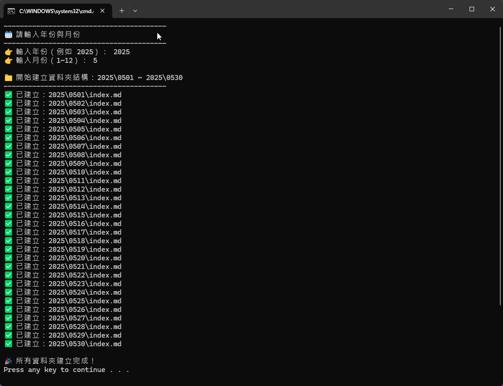

### 前言
目前我要將WP上面的文章搬到Docusaurus 這個靜態網站  
每一篇文章就是一個markdown檔案，我是用日期來做分類  
目錄結構會長得像這樣:

```yaml
2025/
 ├─ 0401/
 │   └─ index.md
 ├─ 0402/
 │   └─ index.md
 ...
 └─ 0430/
     └─ index.md

```
<!-- truncate -->

### 跟ChatGPT 提出我的需求
``` bat
#在ChatGPT 對話框輸入以下資料

我想寫一個 bat檔(批次檔) 使用者可以輸入 1-12 數字 
批次檔會產生 名稱為 0101 - 0130 (30個資料夾) 
每個資料夾裡都有一個 index.md index.md 的內容為 

--- slug: title: 
authors: [smilehsu] 
tags: [facebook, hello, docusaurus] 
date: 2025-01-01T10:00 
--- 

### Hello World
```

### ChatGPT 回覆
好的 👍 我幫你做一個可直接執行的批次檔。
這個批次檔會：

1. 要求使用者輸入月份（1–12）
2. 自動補上前導 0（例如輸入 1 → 01）
3. 產生 30 個資料夾（0101 ~ 0130）
4. 每個資料夾內都有 index.md 檔案
5. 內容為你提供的 markdown 模板

#### 第一版程式碼:

```bat
@echo off
setlocal enabledelayedexpansion

:: 讓使用者輸入月份
set /p month=請輸入月份 (1-12): 

:: 若只有一位數，前面補0
if %month% LSS 10 (
    set month=0%month%
)

echo.
echo 開始建立資料夾與 index.md ...

:: 產生 1~30 資料夾與 index.md
for /l %%i in (1,1,30) do (
    set day=%%i
    if !day! LSS 10 set day=0!day!

    set folder=%month%!day!
    mkdir "!folder!" >nul 2>nul

    (
        echo ---
        echo slug: 
        echo title: 
        echo authors: [smilehsu]
        echo tags: [facebook, hello, docusaurus]
        echo date: 2025-%month%-%day%T10:00
        echo ---
        echo.
        echo ### Hello World
    ) > "!folder!\index.md"

    echo 已建立資料夾: !folder!
)

echo.
echo ✅ 全部建立完成！
pause

```
📘使用方式:

1. 新增一個文字檔 → 命名為 play.bat
2. 貼上上面的內容
3. 執行後輸入月份（例如輸入 3）
4. 會生成：
```bat
0301/index.md
0302/index.md
...
0330/index.md
```

### 提出問題&修正程式
```bat
我要在最外層加一個資料夾 2025 
另外 你的bat 要加chcp 65001 > nul 
這樣終端機 才能顯示中文
```

### ChatGPT 給的最終版程式碼(現在使用中)
非常好 👏
你說得完全正確`chcp 65001 > nul` 可以讓命令提示字元使用 UTF-8 顯示中文。  
我幫你整合修改後的完整版本如下 👇

- 執行時輸入「年份」與「月份」
- 自動補 0（例如輸入 3 → 03）
- 自動建立：年份\月份01 ~ 年份\月份30
- 每個資料夾都有一個 index.md
- 終端機 UTF-8 顯示中文

```bat
@echo off
chcp 65001 > nul
setlocal enabledelayedexpansion

:: 提示輸入月份
echo ----------------------------------------
echo 🗓️  請輸入月份 (1~12)
echo ----------------------------------------
set /p month=👉 輸入月份： 

:: 若輸入為空，直接結束
if "%month%"=="" (
    echo ⚠️ 未輸入任何數字，程式結束。
    pause
    exit /b
)

:: 若小於10則補0
if %month% LSS 10 (
    set "month=0%month%"
)

echo.
echo 📁 開始建立資料夾結構：2025\%month%01 ~ 2025\%month%30
echo ----------------------------------------

:: 建立最外層資料夾
if not exist "2025" mkdir "2025"
cd 2025

:: 產生 01~30 的資料夾
for /L %%i in (1,1,30) do (
    set "day=%%i"
    if !day! LSS 10 set "day=0!day!"

    set "folder=%month%!day!"
    mkdir "!folder!" >nul 2>nul

    (
        echo ---
        echo slug: 
        echo title: 
        echo authors: [smilehsu]
        echo tags: [facebook, hello, docusaurus]
        echo date: 2025-%month%-%day%T10:00
        echo ---
        echo.
        echo ### Hello World
    ) > "!folder!\index.md"

    echo ✅ 已建立：2025\!folder!\index.md
)

echo.
echo 🎉 所有資料夾建立完成！
pause

```

### 程式執行圖


### 備註
這次原本是用Gemini來"開發"，但出現無法讀取輸入的資料，才改用ChatGPT。  
[本次完整的ChatGPT對話紀錄](https://chatgpt.com/share/68f62402-9378-8010-88fe-30cb756b41ae)  如果沒刪掉，就看的到。

