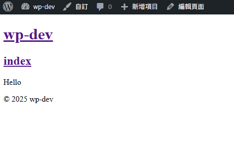

### ✨前言
我要試著開發自己的WP佈景主題，就問了Gemini該如何建立一個空白的主題

<!-- truncate -->

Gemini的回答:  
```shell
建立一個空白的 WordPress 佈景主題（Blank Theme）是開發自訂主題的第一步。   
這通常需要您手動建立一些基本的檔案結構。  

以下是建立一個經典空白佈景主題（Classic Blank Theme）的基本步驟和所需檔案：
```

### 🧩步驟 1：建立主題資料夾
導航到您的 WordPress 安裝目錄下的 wp-content/themes/ 資料夾。

建立一個新的資料夾，用來存放您的主題。資料夾名稱將作為您的主題的唯一識別名稱  
（建議使用小寫字母和連字號，例如：my-blank-theme）。

### 📄步驟 2：建立必需的檔案
至少需要兩個檔案才能讓 WordPress 識別您的主題：style.css 和 index.php。

1. style.css（樣式表與主題資訊）  
在您的主題資料夾內建立一個名為 style.css 的檔案，並在開頭加入以下主題資訊標頭。  
 WordPress 會讀取這些資訊來顯示在後台的  「外觀」>「佈景主題」頁面：  

```css
/*
Theme Name: 我的空白主題 (My Blank Theme)
Theme URI: https://yourwebsite.com/
Author: 您的名字 (Your Name)
Author URI: https://yourwebsite.com/
Description: 一個用來從頭開始建立主題的空白 WordPress 佈景主題。
Version: 1.0
License: GNU General Public License v2 or later
License URI: http://www.gnu.org/licenses/gpl-2.0.html
Text Domain: my-blank-theme
Tags: blank, custom-theme
*/

/* 在這裡加入您的 CSS 樣式 */
```
#### 💡提示:
* Theme Name 是唯一必需的欄位，WordPress 會以此名稱顯示主題。
* Text Domain 建議與您的主題資料夾名稱一致，用於國際化/翻譯。


2. 🧱index.php（主模板檔案）  
在您的主題資料夾內建立一個名為 index.php 的檔案。這是 WordPress 在找不到更具體模板時的預設後備檔案。  
對於空白主題，您可以先放一個基本的 HTML 結構  

```php
<?php
/**
 * 主要模板檔案
 *
 * 這是 WordPress 模板層次結構中的後備模板。
 * 用於顯示文章、頁面或其他內容。
 */
?>
<!DOCTYPE html>
<html <?php language_attributes(); ?>>
<head>
    <meta charset="<?php bloginfo( 'charset' ); ?>">
    <meta name="viewport" content="width=device-width, initial-scale=1">
    <title><?php wp_title( '|', true, 'right' ); ?></title>
    <?php wp_head(); ?>
</head>
<body 
<?php body_class(); ?>>
    <header>
        <h1><a href="<?php echo esc_url( home_url( '/' ) ); ?>"><?php bloginfo( 'name' ); ?></a></h1>
    </header>

    <div id="content" class="site-content">
        <?php
        if ( have_posts() ) :
            while ( have_posts() ) : the_post();
                ?>
                <article id="post-<?php the_ID(); ?>" <?php post_class(); ?>>
                    <h2><a href="<?php the_permalink(); ?>"><?php the_title(); ?></a></h2>
                    <?php the_content(); ?>
                </article>
                <?php
            endwhile;
        else :
            ?>
            <p>沒有找到任何內容。</p>
            <?php
        endif;
        ?>
    </div>
    <footer>
        <p>&copy; <?php echo date('Y'); ?> <?php bloginfo( 'name' ); ?></p>
    </footer>

    <?php wp_footer(); ?>
</body>
</html>
```

### ⚙️步驟 3：建立 functions.php
建立一個名為 functions.php 的檔案，用於新增主題功能、掛載腳本和樣式等。這是核心功能檔案。

在您的主題資料夾內建立 functions.php，並加入以下程式碼來正確掛載您的 style.css：

```php
<?php
/**
 * 佈景主題設定和功能
 */

if ( ! function_exists( 'my_blank_theme_scripts' ) ) :
    /**
     * 掛載樣式和腳本
     */
    function my_blank_theme_scripts() {
        // 掛載主要的樣式表
        wp_enqueue_style( 'my-blank-theme-style', get_stylesheet_uri() );

        // 您可以在這裡加入其他樣式或 JavaScript 檔案
    }
    add_action( 'wp_enqueue_scripts', 'my_blank_theme_scripts' );
endif;

// 您可以在這裡加入其他主題支援，例如文章縮圖、自訂選單等
/*
function my_blank_theme_setup() {
    add_theme_support( 'title-tag' ); // 讓 WordPress 管理頁面標題
    add_theme_support( 'post-thumbnails' ); // 啟用文章縮圖
    register_nav_menus( array( // 註冊選單位置
        'primary' => esc_html__( '主要選單', 'my-blank-theme' ),
    ) );
}
add_action( 'after_setup_theme', 'my_blank-theme_setup' );
*/
```

### 🚀步驟 4：啟用佈景主題
1. 登入您的 WordPress 後台。
2. 前往 外觀 > 佈景主題。
3. 您應該會看到您的新主題 「我的空白主題」（或您設定的名稱）出現在列表中。
4. 點擊 啟用。

### 🧱步驟 5：下一步（可選檔案）
您的空白主題現在已經可以運作了，但通常還會需要更多檔案來處理不同的頁面和區塊，例如：

| 📁檔案名稱 | 🧭用途 |
| :--- | :--- |
| header.php | 網站的頁首區塊（通常包含 `<head>` 和標頭內容） |
| footer.php | 網站的頁尾區塊（通常包含 `<footer>` 和 `wp_footer()`） |
| sidebar.php | 側邊欄模板 |
| single.php | 單篇文章顯示模板 |
| page.php | 靜態頁面顯示模板 |
| screenshot.png 或 screenshot.jpg | 顯示在後台主題列表中的縮圖（建議尺寸：1200x900 像素） |

您可以將 index.php 的內容分割成 header.php 和 footer.php，然後在 index.php 中使用 WordPress 函數引用它們：

在 index.php 頂部替換 `<head>` 和標頭相關程式碼為：`<?php get_header(); ?>`
在 index.php 底部替換 `<footer>` 和 wp_footer() 相關程式碼為：`<?php get_footer(); ?>`

### 🖼️成果展示




---

#### 💬提示：

如果您想建立區塊主題 (Block Theme)，流程會有所不同，主要依賴 theme.json 和 HTML 模板檔案，而不是 PHP 模板檔案。您可以考慮使用 WordPress 官方提供的外掛 "Create Block Theme" 來更快速地建立空白區塊主題。
