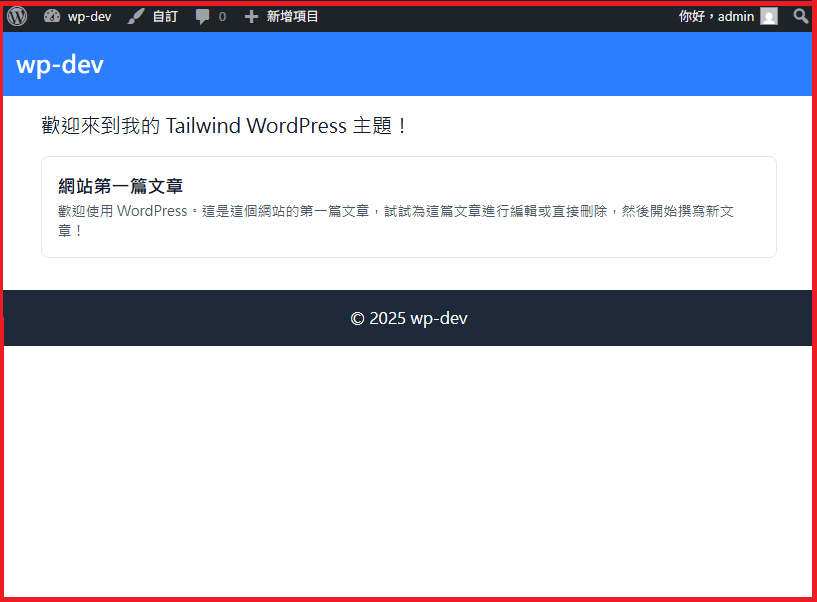

### ✨前言

在上一篇 [建立 WP 空白的佈景主題](../1021/index.md) ，已經建立乾淨的空白主題  
接下來，我想導入Tailwind CSS到這個佈景主題中  
我就問Gemini要怎麼做，原本以為是個簡單任務  
沒想到，一直碰到鬼打牆，拿舊的(3.x)設定方式當回覆  
也是弄了兩三個小時，才得拼湊出正確的設定  

<!-- truncate -->
### 建立最簡佈景主題骨架 (Minimal Theme Setup)

首先，您需要一個新的資料夾和三個最基本的 WordPress 佈景主題檔案。

### 1. 建立主題資料夾

在您的 WordPress 安裝目錄中，進入 `wp-content/themes/`，然後建立一個新的資料夾  
例如命名為 `my-tailwind-theme`。

### 2. 建立 `style.css` (佈景主題標頭)

這是 WordPress 識別佈景主題所必需的檔案。在 `my-tailwind-theme` 資料夾內建立 `style.css`，並加入以下內容：
```css
/*
Theme Name: My Tailwind Theme
Theme URI: [你的網站 URL]
Author: [你的名稱]
Author URI: [你的網站 URL]
Description: A custom WordPress theme built with Tailwind CSS.
Version: 1.0
Text Domain: my-tailwind-theme
*/

/* 這是 WordPress 的主樣式表，但我們將使用編譯後的 Tailwind CSS */
```
### 3. 建立 `index.php` (佈景主題主檔案)

這是佈景主題的入口點。建立 `index.php`，並加入基本的 HTML 結構和 WordPress 函式:
```php
<?php
/**
 * The main template file.
 */
?>
<!DOCTYPE html>
<html <?php language_attributes(); ?>>
<head>
    <meta charset="<?php bloginfo( 'charset' ); ?>">
    <meta name="viewport" content="width=device-width, initial-scale=1">
    <?php wp_head(); ?>
</head>
<body <?php body_class( 'text-gray-900 bg-white' ); ?>>

    <header class="bg-blue-500 p-4 text-white">
        <h1 class="text-2xl font-bold"><?php bloginfo( 'name' ); ?></h1>
    </header>

    <main class="container mx-auto p-4">
        <h2 class="text-xl mb-4">歡迎來到我的 Tailwind WordPress 主題！</h2>
        <?php
        if ( have_posts() ) {
            while ( have_posts() ) {
                the_post();
                ?>
                <article class="p-4 border border-gray-200 rounded-lg mb-4">
                    <h3 class="text-lg font-semibold"><?php the_title(); ?></h3>
                    <div class="text-sm text-gray-600"><?php the_content(); ?></div>
                </article>
                <?php
            }
        } else {
            echo '<p>沒有文章可顯示。</p>';
        }
        ?>
    </main>

    <footer class="bg-gray-800 p-4 text-white text-center">
        <p>&copy; <?php echo date('Y'); ?> <?php bloginfo( 'name' ); ?></p>
    </footer>

    <?php wp_footer(); ?>
</body>
</html>
```
### 4. 建立 `functions.php` (註冊樣式)

這個檔案用來告訴 WordPress 載入你的樣式檔案。建立 `functions.php`，並加入以下內容：
```php
<?php
/**
 * Theme functions and definitions
 */

if ( ! function_exists( 'my_tailwind_theme_scripts' ) ) {
	/**
	 * Enqueue styles and scripts.
	 */
	function my_tailwind_theme_scripts() {
		// 載入編譯後的 Tailwind CSS 檔案
		wp_enqueue_style( 'my-tailwind-theme-style', get_template_directory_uri() . '/dist/style.css', array(), '1.0' );

		// 載入 WordPress 預設的 style.css (僅用於讀取主題標頭)
        wp_enqueue_style( 'my-tailwind-theme-main', get_stylesheet_uri(), array( 'my-tailwind-theme-style' ), '1.0' );

	}
}
add_action( 'wp_enqueue_scripts', 'my_tailwind_theme_scripts' );
```

### 如何在 WordPress 佈景主題中導入 Tailwind CSS？

### 1. 初始化專案環境

你需要具備 **Node.js** 和 **npm** (或 Yarn) 的環境。

1.  在你的`佈景主題根目錄下`，初始化一個 Node.js 專案：
``` shell
npm init -y
npm install -D @tailwindcss/cli @tailwindcss/postcss
```

#### 新增 tailwind.config.js (在佈景主題跟目錄下)
```js
// tailwind.config.js
/** @type {import('tailwindcss').Config} */
module.exports = {
    // v4.x 會嘗試自動偵測內容，但您仍然可以在此處提供路徑作為備援
    // content: ["./**/*.php", "./**/*.js"],
    theme: {
        extend: {
            // 您的自訂顏色、字體等...
        },
    },
    plugins: [],
};
```
#### src\input.css

```css
@import  "tailwindcss";
```
postcss.config.js
```js
// postcss.config.js
module.exports = {
    plugins: [
        "@tailwindcss/postcss", // 這是 v4.x 整合的唯一插件
    ],
};

```

### 2. 修改 `package.json` 腳本

由於您現在使用 `tailwindcss` 的執行檔名是 **`@tailwindcss/cli`**，您需要修改您的 `package.json` 腳本來執行它。

請將您的 `package.json` 中的 `scripts` 部分修改為：

```json
"scripts": {
  "dev": "npx @tailwindcss/cli -i ./src/input.css -o ./dist/style.css --watch",
  "build": "npx @tailwindcss/cli -i ./src/input.css -o ./dist/style.css --minify"
},
```

### 3. 重新執行開發模式

儲存 `package.json` 檔案後，再次運行您的開發腳本：`npm run dev`  

### 🖼️成果展示


太棒了！您已經成功地設定了現代化的 Tailwind CSS v4.x 開發環境，這是最困難的部分。  
現在我們可以專注於開發您的 WordPress 佈景主題結構了。