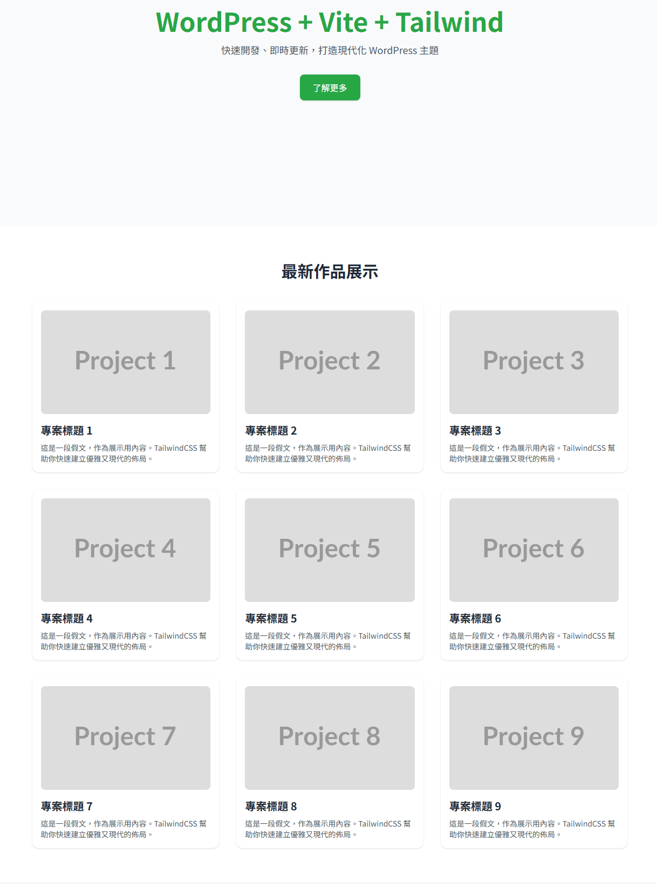

### ✨前言
上一篇把TailwindCSS導入佈景主題後，接著我想是看看能不能在佈景主題也用Vite+React  
因為之前在Udemy買過 WordPress Headless CMS的課程，當初課程內容就是前後端分離  
把WP當後端用，用API撈資料給前端(React)

<!-- truncate -->

問了Gemini ，鬼打牆一兩個小時後放棄，在github 找幾個年份相近的範例  
到本機上都是error，最後問了ChatGPT 直接打包一個佈景主題檔讓我下載  
丟到本機端，馬上可以使用，真不愧是我大哥ChatGPT  
所以這篇我就不寫實作過程了，附上原始碼，下載就能用

### 💻 原始碼下載

``` shell
git clone https://github.com/rs6000/react-vite-tailwind-wp-theme.git
```

### 📁 專案結構
``` shell
react-vite-tailwind-wp-theme/
├── functions.php
├── index.php
├── style.css
├── vite.config.js
├── tailwind.config.js
├── postcss.config.js
├── package.json
├── src/
│   ├── main.jsx
│   ├── App.jsx
│   ├── components/
│   │   ├── Hero.jsx
│   │   └── CardGrid.jsx
│   └── style.css
└── README.md

```

### 🚀 安裝步驟

1. 將整個主題資料夾放入：  
   `wp-content/themes/react-vite-tailwind-wp-theme`

2. 在主題目錄中執行：
   ```bash
   npm install
   npm run build
   ```

3. 啟用主題後，即可看到 React Hero 區塊與 3×3 卡片。

### 🖼 網站截圖



---